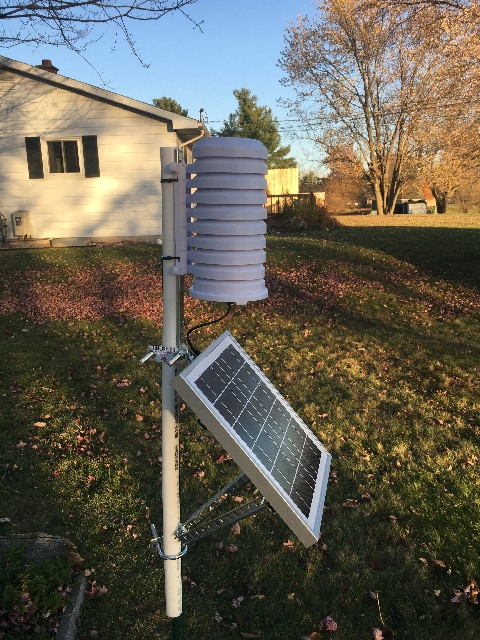

# ESP32 - Weather Station

> ESP32 driven small weather station with focus on parameters usually not captured, including particle density for Air Quality and UV-Index

Regular weather stations that can be purchased are covering temperature, rel. humidity, pressure, wind direction and speed, perhaps rainfall. But parameters like particle count or AQI and UV-Index are harder to find or more expensive, yet these parameters are important when it comes to health. Wind direction and speed are not too hard to add, if somebody is interested, but the main focus is on the less common parameters. The Weather Station is recording all results on a SD card as well as sending the data via Wifi and a REST API to a Weather Station App. The SD card is meant as a backup in case Wifi or server are not available, whereas the data transmitted via Wifi is for viewing the current data in a more convenient way (not opening the station every time). There are more energy efficient ways of transferring the data from the station, but the idea was to have a station, that doesn't require a receiver to further distribute or process the data indoors. Also, the goal was to run it of battery and solar power, to allow it to be placed in any location, without having to connect it to a wired power source.

## Hardware Components

+ **Stevenson Screen**
  + La Crosse [Sensor Weather Shield](https://www.lacrossetechnology.com/925-1418-sensor-weather-shield)
  + 1"x0.75mm Fused Silica Disc: https://amazon.com
+ **Case**
  + Hammond [1591MSGY](https://www.hammfg.com/part/1591MSGY)
+ **Controller (Driver)**
  + Adafruit [ESP32 Feather](https://www.adafruit.com/product/3619)
  + Adafruit [FeatherWing - RTC + SD Add-on](https://www.adafruit.com/product/2922)
  + SanDisk 4GB microSD card
+ **Sensors**
  + Adafruit [BME680 - Pressure/Temperature/Humidity/Gas](https://www.adafruit.com/product/3660)
  + Adafruit [SI1145 - UV/VIS/IR](https://www.adafruit.com/product/1777)
  + Plantower [PMS5003 - Particle PM2.5](http://plantower.com/en)
+ **Power**
  + Adafruit [USB / DC / Solar Lithium Ion/Polymer charger](https://www.adafruit.com/product/390)
  + Waveshare [Solar Panel (6V 5W)](https://www.waveshare.com/solar-panel-6v-5w.htm)
  + 5V DC DC Converter Step Up Power Supply [e.g. AliExpress](https://www.aliexpress.com/item/32635991770.html)
  + ~~Adafruit [LiPO battery, 3.7v 2500mAh](https://www.adafruit.com/product/328)~~
  + Tenergy [Premium AA 2500mAh NiMH Rechargeable Battery](https://power.tenergy.com/tenergy-premium-aa-2500mah-nimh-rechargeable-battery/)
  + Battery Holder 4.5V [AA Battery Holder with Switch](https://www.amazon.com/gp/product/B07C6XC3MP/ref=ppx_yo_dt_b_asin_title_o01_s01?ie=UTF8&psc=1)

## Wiring Components

The FeatherWing - RTC + SD Add-on is stacked on top of the ESP32 Feather.

|  ESP32  |     Function      | SI1145 | BME680 | PMS5003 | 5V DC/DC | LiPo Charger |
| :-----: | :---------------: | :----: | :----: | :-----: | :------: | :----------: |
|   SCL   |       Clock       |  SCL   |  SCK   |    -    |    -     |      -       |
|   SDA   |       Data        |  SDA   |  SDI   |    -    |    -     |      -       |
|   TX    |     Transmit      |   -    |   -    |   RX    |    -     |      -       |
|   RX    |      Receive      |   -    |   -    |   TX    |    -     |      -       |
|   GND   |      Ground       |  GND   |  GND   |   GND   |   GND    |      -       |
|  3.3V   |     3.3 Volt      |  VIN   |  VIN   |    -    |   3.3V   |      -       |
|   VIN   |      5 Volt       |   -    |   -    |  5.0V   |   5.0V   |      -       |
| JTS BAT | Battery Connector |   -    |   -    |    -    |    -     |   GND / B+   |

The Battery is connected to the JTS connector of the LiPo Charger.

## Software and Dependencies

+ **Sensors**
  + BME680: https://github.com/adafruit/Adafruit_BME680
  + SI1145: https://github.com/adafruit/Adafruit_SI1145_Library
  + PMS5003: https://github.com/jbanaszczyk/pms5003
+ **SD**
  + MicroSD: https://www.adafruit.com/product/254
+ **RTC**
  + MicroSD: https://www.adafruit.com/product/3295
+ **Other**
  + [ArduinoJson](https://arduinojson.org) - Powerful JSON parser for Arduino
  + [WiFi](https://www.arduino.cc/en/Reference/WiFi) - Arduino IDE
  + [HTTPClient](https://www.arduino.cc/en/Tutorial/HttpClient) - Arduino IDE
  + [WiFiClientSecure](https://github.com/espressif/arduino-esp32/tree/master/libraries/WiFiClientSecure) - Arduino IDE
  + [math](https://www.arduino.cc/en/Math/H) - Arduino IDE

## Sensors

All sensors are located inside the Stevenson Screen together with the Micro-Controller, charging circuitry and battery.

**SI1145:** On top of the Stevenson Screen is a small hole drilled with the sensor breakout board glued right underneath. The hole is covered by a thin slice of silica glass to protect the sensor and minimize the reduction of UV transmission at the same time.

**BME680:** The sensor breakout board is glued close to the bottom of the encasing. The battery is located at the opposite side to prevent it from skewing the temperature measurements as little as possible when charging.

**PMS5003:** The particle sensor is on top of the box holding the Micro-Controller, charging circuitry and battery.

| Sensor  | Parameters Measured                                                                                                                          | Parameters Derived                               |
| :------ | :------------------------------------------------------------------------------------------------------------------------------------------- | ------------------------------------------------ |
| SI1145  | `Ultraviolet Light (UV) a.u.`, `Visible Light a.u.`, `Infrared Light (IR) a.u.`                                                              | `UV-Index`                                       |
| BME680  | `Temperature ℃`, `rel. Humidity %`, `Pressure hPa`, `Air Quality kΩ`                                                                         | `Dew Point`, `Heat Index`, `Pressure (PSML) hPa` |
| PMS5003 | `PM 1 μg/m³`, `PM 2.5 μg/m³`, `PM 10 μg/m³`, `>0.3 μm/0.1L`, `>0.5 μm/0.1L`, `>1.0 μm/0.1L`, `>2.5 μm/0.1L`, `>5.0 μm/0.1L`, `>10.0 μm/0.1L` | `Air Quality Index`                              |

### UV-Index

The UV-Index is calculated using the UV value from the **SI1145** sensor in the equation below as provided by the sensors data sheet.

<!-- \text{UV-Index} = \frac{\text{UV}}{100} -->

Source: [Sensor Documentation](https://docs.rs-online.com/d56c/0900766b81434411.pdf)

### Dew Point

The Dew Point (℃) is calculated on the device based on the following equation. More details in to code's comments.

<!-- \text{Dew Point }\[\space^{\circ}\text{C}] = 243.04 \times \frac{\left( \log{ \frac{ \text{RH}}{100} } + \left( \frac{ 17.625 \times \text{T} }{ 243.04 + \text{T} }\right) \right)}{ \left(17.625 - \log{\frac{\text{RH}}{100}}\right) - \left(\frac{ 17.625 \times \text{T} }{243.04 + \text{T}}\right)} -->

Source: <http://bmcnoldy.rsmas.miami.edu/Humidity.html>

#### References

Alduchov, O. A., and R. E. Eskridge, 1996: [**Improved Magnus' form approximation of saturation vapor pressure.**](https://doi.org/10.1175/1520-0450(1996)035<0601:IMFAOS>2.0.CO;2) *J. Appl. Meteor.*, 35, 601–609.

August, E. F., 1828: [**Über die Berechnung der Expansivkraft des Wasserdunstes.**](https://doi.org/10.1002/andp.18280890511) *Ann. Phys. Chem.*, 13, 122–137.

Magnus, G., 1844: [**Versuche über die Spannkräfte des Wasserdampfs.**](https://doi.org/10.1002/andp.18441370202) *Ann. Phys. Chem.*, 61, 225–247.

### Heat Index

The Heat Index is calculated using the following equations. All temperature values within the equation are in Fahrenheit (℉). In the last step the value is converted into Celsius (℃) when returned by the device.

<!-- f(x) = 0.5 \times \left( \text{T} + 61.0 + \left( \left( \text{T} - 68.0 \right) \times 1.2 \right) + \left( \text{RH} \times 0.094 \right) \right) -->

In case the Heat Index is above 80 ℉ or 26.67 ℃ one of the following equations are applied to calculate the Heat Index.

<!-- \text{Heat Index} = -42.379 + 2.04901523 \times \text{T} + 10.14333127 \times RH - .22475541 \times \text{T} \times \text{RH} - 0.00683783 \times \text{T}^2 - 0.05481717 \times \text{RH}^2 + 0.00122874 \times \text{T}^2 \times \text{RH} + 0.00085282 \times \text{T} \times \text{RH}^2 \times - 0.00000199 \times \text{T}^2 \times \text{RH}^2 -->

When the rel. Humidity is smaller than 13 % and the temperature is bigger than 80 ℉ or 26.67 ℃ and smaller than 112 ℉ or 44.44 ℃ the following equation needs to be applied.

<!-- \text{Heat Index} = \text{Heat Index} - \frac{13.0 - \text{RH}}{4} \times \frac{\sqrt{17.0- \lvert \text{T}-95.0 \rvert}}{17.0} -->

When the rel. humidity is higher than 85 % and the Temperature is between 80 ℉ and 87 ℉ the following equation applies.

<!-- \text{Heat Index} = \text{Heat Index} + \frac{\text{RH}-85}{10} \times \frac{87-\text{T}}{5} -->

The last step is converting the Heat Index from Fahrenheit to Celsius.

<!-- ^{\circ}\text{C} = \frac{ ^{\circ}\text{F}-32}{1.8} -->

Source: <https://www.wpc.ncep.noaa.gov/html/heatindex_equation.shtml>

### Air Quality Index

The Air Quality Index is calculated using the PM 2.5 value by default. If the AQI for the PM 10 is higher than for PM 2.5, it is taken as the AQI.

<!-- AQI = \frac{Conc - Conc_{low}}{Conc_{heigh} - Conc_{low}} \times (AQI_{high} - AQI_{low}) + AQI_{low} -->

#### PM 2.5 Values

| PM 2.5        | AQI (high) | AQI (low) | Conc (heigh) | Conc (low) |
| ------------- | ---------- | --------- | ------------ | ---------- |
| 0 - 12.1      | 50.0       | 0.0       | 12.0         | 0.0        |
| 12.1 - 35.5   | 100.0      | 51.0      | 35.4         | 12.1       |
| 35.5 - 55.5   | 150.0      | 101.0     | 35.4         | 35.5       |
| 55.5 - 150.5  | 200.0      | 151.0     | 150.4        | 55.5       |
| 150.5 - 250.5 | 300.0      | 201.0     | 250.4        | 150.5      |
| 250.5 - 350.5 | 400.0      | 301.0     | 350.4        | 250.5      |
| 350.5 - 500.5 | 500.0      | 401.0     | 500.4        | 350.5      |

#### PM 10 Values

| PM 10         | AQI (high) | AQI (low) | Conc (heigh) | Conc (low) |
| ------------- | ---------- | --------- | ------------ | ---------- |
| 0 - 55.0      | 50.0       | 0.0       | 54.0         | 0.0        |
| 55.0 - 155.0  | 100.0      | 51.0      | 154.0        | 55.0       |
| 155.0 - 255.0 | 150.0      | 101.0     | 254.0        | 155.0      |
| 255.0 - 355.0 | 200.0      | 151.0     | 354.0        | 255.0      |
| 355.0 - 425.0 | 300.0      | 201.0     | 424.0        | 355.0      |
| 425.0 - 505.0 | 400.0      | 301.0     | 504.0        | 425.0      |
| 505.0 - 605.0 | 500.0      | 401.0     | 604.0        | 505.0      |

Source: <https://www.airnow.gov/aqi/aqi-calculator-concentration>

### Pressure (PSML)

Most weather reports provide the ambient pressure normalized to sea level (PSML). It is calculated on the device using the following equation.

<!-- \text{Pressure (PMSL)} = \frac{ \frac{P}{100} } { 1.0 - \left( \frac{\text{ALT}}{44330.0} \right) ^{5.255} }   -->

Source: <https://forums.adafruit.com/viewtopic.php?t=105831>

### Precision

None of the sensors used in the weather station have been calibrated other than the calibrations that were done at the factory. All measurements were compared to the closest local weather station and seem to be in good agreement. The data from the **BME680** is pretty much spot on. The UV index by the **SI1145** seems to be on the lower end but at the same time is very hard to compare in the winter, since the amount of UV light is low to begin with and the azimuth is low as well. The next summer will show how the measurements work and if the glass is absorbing too much UV. The particle measurements from the **PMS5003** are comparable to the results from the closest station, but can deviate more, since very local sources of particles, like a neighbor's BBQ can change the result. Further the  official AQI (Air Quality Index) is taking other pollutants into account, that the Weather Station is not equipped for, like Ozone (O₃), which can be the main contributor to the AQI, thus underestimating the AQI.

## Battery Life | Solar Power

The data is recorded in 5 min intervals, putting the ESP into sleep mode in between measurements to save power. The biggest power consumption is by the particle sensor's fan. It is running for a minimum duration of 30 seconds before each measurement. So far the solar panel is able to recharge the battery in about 2-3h (November), but the winter will show if it can keep the battery sufficiently charged, especially under cloudy conditions, snow and low temperatures.

### Cold Weather Issue

Expecting a faster degradation of the LiPo battery due to cold temperature, I was not expecting it to be this fast. After a few days of low light and one night of -6 ℃ or 21 ℉, the battery was depleted. Charging up the battery was not working any more, instead it just puffed up like a balloon.

Since the weather station is located in Michigan, periods with temperatures below -18 ℃ or 0 ℉ are to be expected in the winter. To account for this, one option would be, to use a different battery type like Nickel–metal hydride or Lead Acid. The other option would be to use super capacitors (super-caps). Those can be operate under extreme temperatures, but the downside is their low capacity and relatively large size compared to a standard battery.

#### Ni-MH AA Batteries

Nickel–metal hydride batteries from Tenergy are advertised to perform even under extreme conditions -20 ℃ (-4°F) to 60 ℃ (140 ℉) with a capacity of 2500 mAh. If they work, they are probably a better option in terms of capacity, than the super-caps. Also the standard AA size will make it easier to replace damaged cells. The batteries are attached underneath the Stevenson Screen in a box with an on/off switch. They are too big to go inside the screen like the previous LiPo battery.
